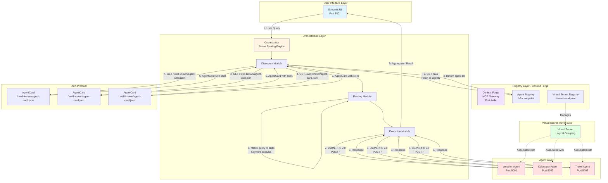
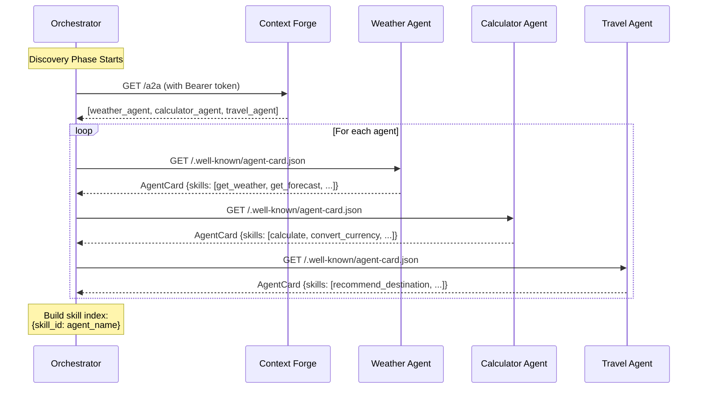
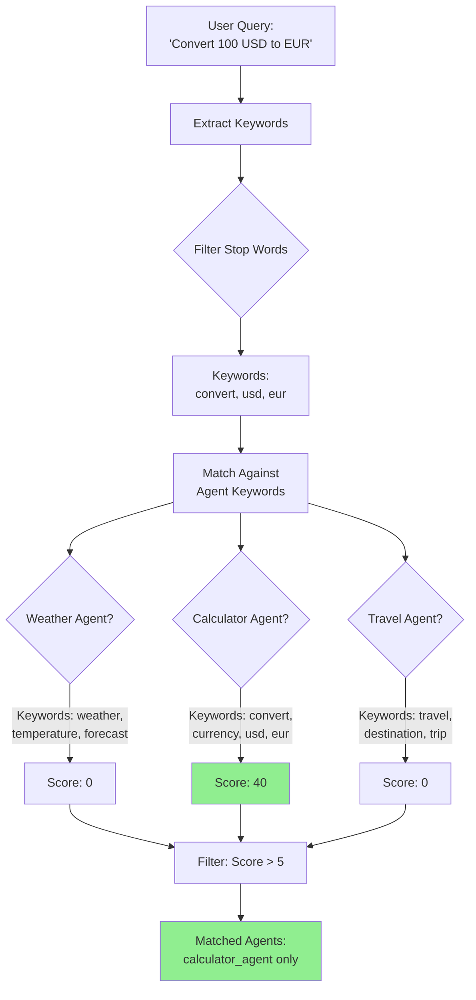
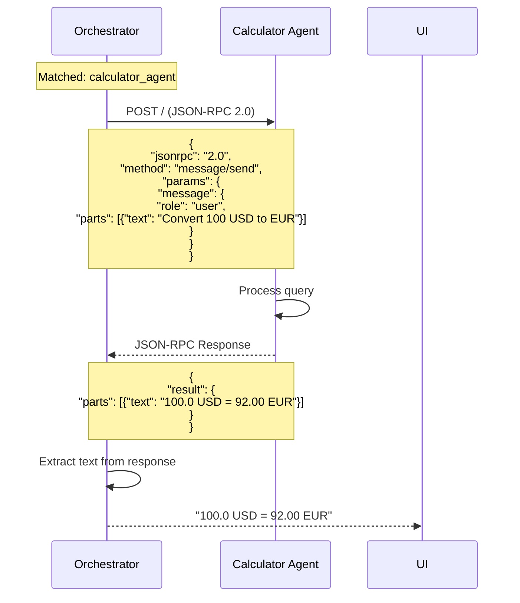
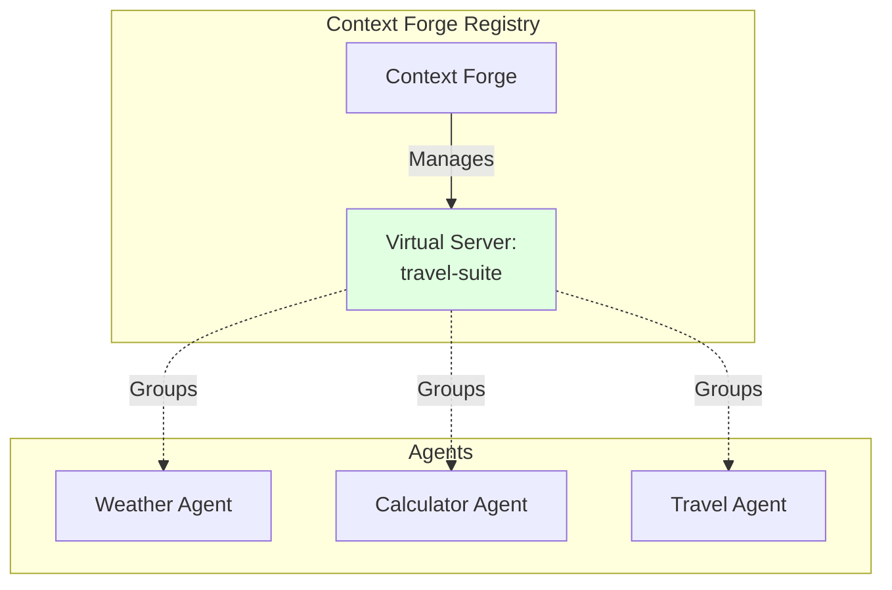
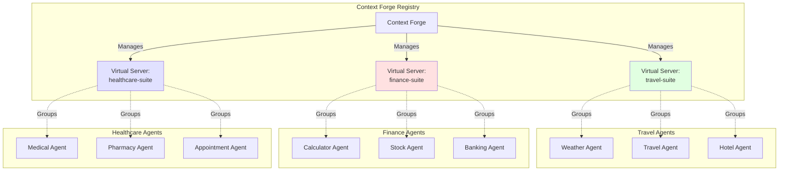

# A2A Multi-Agent Orchestrator - Architecture Documentation

## 🎯 High-Level Architecture



## 📋 Detailed Flow Explanation

### Phase 1: Discovery (Lines 19-83 in orchestrator.py)



**Key Points:**
- Orchestrator queries Context Forge's `/a2a` endpoint to get ALL registered agents
- For each agent, fetches AgentCard from `/.well-known/agent-card.json`
- Builds local cache: `{agent_name: {endpoint, skills, card}}`
- Creates skill index for fast lookup

### Phase 2: Query Routing (Lines 85-105 in orchestrator.py)



**Routing Algorithm:**
1. **Stop Word Filtering**: Remove common words (to, in, a, the, etc.)
2. **Keyword Extraction**: Extract meaningful words from query
3. **Agent-Specific Matching**: Check against predefined keyword dictionaries
4. **Skill Description Matching**: Match keywords in skill descriptions
5. **Scoring**: Assign scores based on match quality
6. **Filtering**: Only return agents with score > 5

### Phase 3: Execution (Lines 107-159 in orchestrator.py)



## 🔄 Virtual Server Concept

### Current Setup: Single Virtual Server



**Current Behavior:**
- Orchestrator queries: `GET /a2a` → Returns ALL agents
- Virtual server "travel-suite" is a **logical grouping** only
- No filtering by virtual server in current implementation

### Multi-Virtual Server Architecture



### How to Use Virtual Servers

#### Option 1: Query Specific Virtual Server (Recommended)

**Modify orchestrator to query virtual server endpoint:**

```python
# Current (queries ALL agents):
response = await client.get(f"{CONTEXT_FORGE_URL}/a2a")

# Modified (queries specific virtual server):
VIRTUAL_SERVER_NAME = "travel-suite"
response = await client.get(
    f"{CONTEXT_FORGE_URL}/servers/{VIRTUAL_SERVER_NAME}/agents"
)
```

**Benefits:**
- ✅ Only discovers agents in that virtual server
- ✅ Faster discovery (fewer agents to query)
- ✅ Domain-specific routing (travel queries only go to travel agents)
- ✅ Better isolation between domains

#### Option 2: Filter After Discovery

```python
# Discover all agents
all_agents = await client.get(f"{CONTEXT_FORGE_URL}/a2a")

# Filter by virtual server
virtual_server_id = "travel-suite-id"
filtered_agents = [
    agent for agent in all_agents 
    if virtual_server_id in agent.get('virtual_servers', [])
]
```

### Virtual Server Use Cases

#### Use Case 1: Domain Isolation
```
travel-suite: Weather, Travel, Hotel agents
finance-suite: Calculator, Stock, Banking agents
healthcare-suite: Medical, Pharmacy, Appointment agents
```

**Query Flow:**
```
User: "What's the weather in Paris?"
→ Orchestrator queries: /servers/travel-suite/agents
→ Only discovers: Weather, Travel, Hotel agents
→ Routes to: Weather agent
```

#### Use Case 2: Multi-Tenant Architecture
```
tenant-acme-corp: Custom agents for Acme Corp
tenant-globex: Custom agents for Globex
tenant-initech: Custom agents for Initech
```

**Query Flow:**
```
User (Acme Corp): "Generate report"
→ Orchestrator queries: /servers/tenant-acme-corp/agents
→ Only discovers: Acme Corp's custom agents
→ Routes to: Acme's Report Generator agent
```

#### Use Case 3: Environment Separation
```
production-suite: Production-ready agents
staging-suite: Testing agents
development-suite: Development agents
```

## 🔧 Implementation Changes for Virtual Server Support

### Current Code (orchestrator/orchestrator.py):
```python
async def discover_agents(self):
    """Discover agents from Context Forge registry"""
    async with httpx.AsyncClient(timeout=30.0) as client:
        # Gets ALL agents
        response = await client.get(
            f"{CONTEXT_FORGE_URL}/a2a",
            headers={"Authorization": f"Bearer {BEARER_TOKEN}"}
        )
```

### Modified Code (with virtual server support):
```python
async def discover_agents(self, virtual_server_name=None):
    """Discover agents from Context Forge registry
    
    Args:
        virtual_server_name: Optional virtual server to query.
                           If None, queries all agents.
    """
    async with httpx.AsyncClient(timeout=30.0) as client:
        if virtual_server_name:
            # Query specific virtual server
            endpoint = f"{CONTEXT_FORGE_URL}/servers/{virtual_server_name}/agents"
        else:
            # Query all agents
            endpoint = f"{CONTEXT_FORGE_URL}/a2a"
        
        response = await client.get(
            endpoint,
            headers={"Authorization": f"Bearer {BEARER_TOKEN}"}
        )
```

### Usage:
```python
# Discover all agents (current behavior)
await orchestrator.discover_agents()

# Discover only travel-suite agents
await orchestrator.discover_agents(virtual_server_name="travel-suite")

# Discover only finance-suite agents
await orchestrator.discover_agents(virtual_server_name="finance-suite")
```

## 📊 System Components

### 1. Context Forge (MCP Gateway)
- **Port**: 4444
- **Role**: Central registry for agents and virtual servers
- **Endpoints**:
  - `GET /a2a` - List all agents
  - `POST /a2a` - Register new agent
  - `GET /servers` - List all virtual servers
  - `POST /servers` - Create virtual server
  - `GET /servers/{name}/agents` - Get agents in virtual server

### 2. Orchestrator
- **Role**: Discovery, routing, and execution coordinator
- **Key Functions**:
  - `discover_agents()` - Phase 1: Fetch agents and AgentCards
  - `match_query_to_skills()` - Phase 2: Smart routing
  - `invoke_agent()` - Phase 3: Execute agent calls

### 3. A2A Agents
- **Protocol**: A2A v0.3.0 (JSON-RPC 2.0)
- **Required Endpoints**:
  - `GET /.well-known/agent-card.json` - AgentCard
  - `POST /` - Message handling (JSON-RPC)

### 4. Streamlit UI
- **Port**: 8501
- **Features**:
  - Query interface with smart routing
  - Agent dashboard with metrics
  - Example queries for testing

## 🎯 Key Takeaways

1. **Virtual Servers are Logical Groupings**: They don't change agent behavior, just how they're discovered
2. **Current Implementation**: Queries ALL agents via `/a2a` endpoint
3. **Virtual Server Support**: Would query specific endpoint `/servers/{name}/agents`
4. **Smart Routing**: Happens AFTER discovery, filters agents based on query keywords
5. **Scalability**: Virtual servers enable domain isolation and multi-tenancy

## 🚀 Next Steps for Virtual Server Support

To fully leverage virtual servers:

1. **Add virtual_server_name parameter** to orchestrator
2. **Modify discovery endpoint** to use `/servers/{name}/agents`
3. **Update Streamlit UI** to allow virtual server selection
4. **Create multiple virtual servers** for different domains
5. **Test cross-domain isolation** to ensure proper filtering